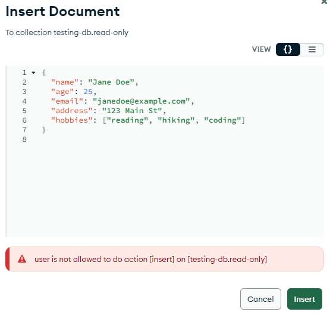
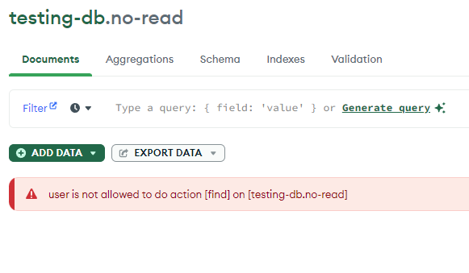
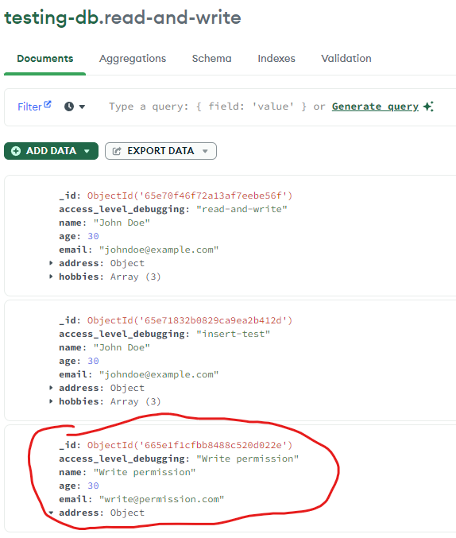
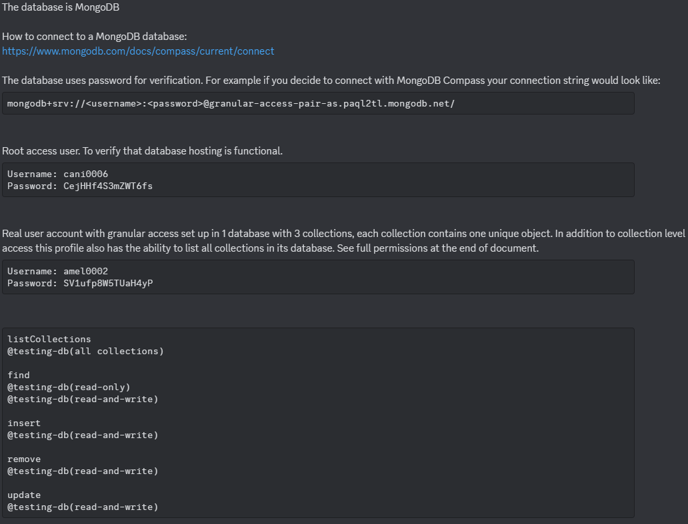

# 04a

SSE example written in JavaScript.

# 04b

## Exposee

To connect to the database, use the following template connection string in MongoDB Compass:

`mongodb+srv://<username>:<password>@04b.mvqqhip.mongodb.net/`

Credentials:

```
Username: integrator
Password: gTtlSVW3az
```

The user has the following permissions:

- Read only acess to `public_data` collection
- Read-write access to `protected_data` collection
- No access to `restricted_data` collection

## Integrator

User credentials provided to me:

```
Username: amel0002
Password: SV1ufp8W5TUaH4yP
```

- Read only access to the `read-only` collection.
- Read-write access to the `read-and-write` collection.
- No access to the `no-read` collection.

I was able to read the data in the `read-only` collection, but was unable to write anything.



I was unable to access any data in the `no-read` collection.



I was able to read and write in the `read-and-write` collection



## Research

Database choice: MongoDB

Reasoning:

- Granular Access control
- Flexible schemas
- Free hosting/Ease of use

Some cons:

- Can have higher storage consumption

Other databases:

- MySQL has robust support for transactions and data integrity, but has limited support for granular access in comparison.
- Postgres, much like MongoDB is capable of being granular, but requires more effort to configure.

## Instructions sent to me

